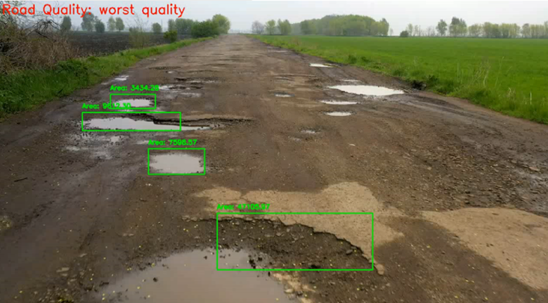
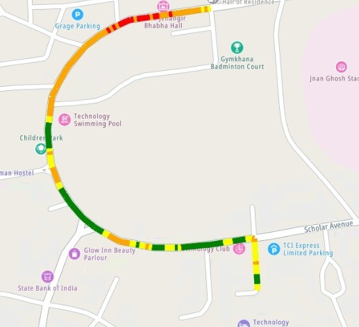

# PotholeMapping

PotholeMapping is a web-based application for detecting and mapping potholes on roads using YOLOv8 object detection. This project provides a dashboard to visualize detected potholes, road quality, and create routes with customized markers.

### Machine Learning Intern, IIT Kharagpur
https://github.com/harshitsharma-dev/PotholeMapping


## Table of Contents

- [Introduction](#introduction)
- [Features](#features)
- [Installation](#installation)
- [Usage](#usage)
- [File Structure](#file-structure)
- [Contributing](#contributing)
- [License](#license)

## Introduction

PotholeMapping is designed to assist in detecting potholes on roads and mapping their locations. It leverages YOLOv8, a state-of-the-art object detection model, to identify potholes in images and videos. The detected information is then displayed on an interactive map, allowing users to analyze road quality and plan routes accordingly.

## Features

- **Pothole Detection:** Detect potholes using YOLOv8 in images and videos.
- **Map Integration:** Visualize detected potholes on an interactive map.
- **Route Creation:** Create and customize routes with markers.
- **Road Quality Analysis:** Display road quality based on detected potholes.

## Installation

1. **Clone the Repository:**
   ```sh
   git clone https://github.com/harshitsharma-dev/PotholeMapping.git
   cd PotholeMapping
   ```

2. **Set Up a Virtual Environment:**
   ```sh
   python3 -m venv env
   source env/bin/activate  # On Windows, use `env\Scripts\activate`
   ```

3. **Install Dependencies:**
   ```sh
   pip install -r requirements.txt
   ```

4. **Run the Application:**
   ```sh
   flask run
   ```

## Usage

1. **Upload Image/Video:**
   - Navigate to the upload section and choose an image or video file for detection.
   - The detected results will be displayed on the map.

2. **Map Interaction:**
   - Add markers, search locations, and create routes on the interactive map.
   - Customize the travel mode and visualize the road quality.

3. **Analysis:**
   - View the detected potholes and road quality analysis on the dashboard.

## File Structure

```
PotholeMapping/
│
├── app/
│   ├── static/
│   ├── templates/
│   ├── __init__.py
│   ├── routes.py
│   ├── yolov8.py
│   └── ...
│
├── requirements.txt
├── README.md
└── ...
```

## Contributing

Contributions are welcome! Please read the [contribution guidelines](CONTRIBUTING.md) before getting started.

## License

This project is licensed under the MIT License. See the [LICENSE](LICENSE) file for more information.

---

Feel free to customize this README according to your project's specific requirements and structure. Let me know if you'd like any modifications!
